# A Survey of Object Goal Navigation 

> Markdown conversion of `Sun 等 - 2025 - A Survey of Object Goal Navigation.pdf` (17 pages). Source PDF SHA256: `7bf2195c133d0c7017d2b01f5d83be704664ab2236888fb903663c2307e1df96`.

Jingwen Sun , Jing Wu , _Member, IEEE_ , Ze Ji , _Member, IEEE_ , and Yu-Kun Lai , _Member, IEEE_ 

> Manuscript received 22 December 2023; accepted 24 February 2024. Date of publication 19 March 2024; date of current version 5 February 2025. This article was recommended for publication by Associate Editor H. Fourati and Editor D. Song upon evaluation of the reviewers’ comments. This work was supported in part by China Scholarship Council-Cardiff University Scholarship under Grant CSC202006120013. _(Corresponding author: Jing Wu.)_ 
>
> Jingwen Sun, Jing Wu, and Yu-Kun Lai are with the School of Computer Science and Informatics, Cardiff University, CF24 4AG Cardiff, U.K. (e-mail: sunj39@cardiff.ac.uk; wuj11@cardiff.ac.uk; laiy4@cardiff.ac.uk). Ze Ji is with the School of Engineering, Cardiff University, CF24 3AA Cardiff, U.K. (e-mail: jiz1@cardiff.ac.uk). Digital Object Identifier 10.1109/TASE.2024.3378010 

**_Abstract_ — Object Goal Navigation (ObjectNav) refers to an agent navigating to an object in an unseen environment, which is an ability often required in the accomplishment of complex tasks. Though it has drawn increasing attention from researchers in the Embodied AI community, there has not been a contemporary and comprehensive survey of ObjectNav. In this survey, we give an overview of this field by summarizing more than 70 recent papers. First, we give the preliminaries of the ObjectNav: the definition, the simulator, and the metrics. Then, we group the existing works into three categories: 1) end-to-end methods that directly map the observations to actions, 2) modular methods that consist of a mapping module, a policy module, and a path planning module, and 3) zero-shot methods that use zero-shot learning to do navigation. Finally, we summarize the performance of existing works and the main failure modes and discuss the challenges of ObjectNav. This survey would provide comprehensive information for researchers in this field to have a better understanding of ObjectNav.** 

**_Note to Practitioners_ —This work was motivated by the increased interest in real-world applications of mobile robots. Object Goal Navigation (ObjectNav), which is an important task in these applications, requires an agent to find an object in an unseen environment. To accomplish that, the agent needs to be equipped with the capability to move in the environment, decide where to go, and recognize the object categories. So far, most works on ObjectNav have been done in a simulation environment. We present an overview of the existing works in ObjectNav and introduce them in three categories. Additionally, we analyze the current performance of ObjectNav and the challenges for future research. This paper provides researchers and practitioners with a comprehensive overview of the developed methods in ObjectNav, which can help them to have a good understanding of this task and develop suitable solutions for applications in the real world.** 

**_Index Terms_ — Object goal navigation, semantic navigation, embodied AI.** 

## I. INTRODUCTION 

INDOOR robots operating autonomously in unseen real-world environments are in increasing demand in various practical applications, such as rescuing, disabled assistance, and vacuum cleaning [1], [2]. A fundamental requirement of such a robot is the ability to search for an object and navigate to it. Such a task is defined as Object Goal Navigation (ObjectNav) [3]. As shown in Fig. 1, the robot is given the label of a target object (e.g., a bed) and it has to explore the unseen environment to find the object. 

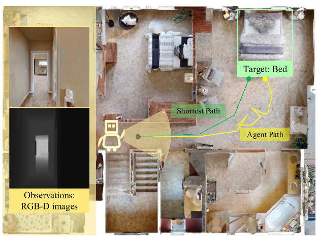

*Fig. 1. A Typical ObjectNav Task. The agent is initialized at the start position, the gray point. It is asked to find the target in the light green box, “Bed”. We illustrate the shortest path and the agent path with green and yellow lines.* 

Classical navigation tasks usually focus on navigating to a point goal with a pre-built map. Such methods would usually require decomposing a task into several sub-components, such as mapping, localization, path planning, and local motion control. For the case in an unseen environment, such navigation usually combines a simultaneous localization and mapping (SLAM) module, a heuristics exploration strategy (e.g., frontier-based exploration [4]), and a path planner to reach the point goal. With the advances in computer vision and deep learning, navigating to an object instead of a point became doable by integrating an object detection module. Moreover, with the shift from “Internet AI”, where agents learn from image and text datasets to “Embodied AI”, where agents learn through interaction with the environment, various simulators have been built to support Embodied AI tasks [5]. At the same time, learning-based navigation was proposed to learn the whole navigation system in such simulation environments. After the Habitat Challenge was released in 2019 [6] and consistent definition and evaluation metrics were proposed, ObjectNav has drawn increasing research attention. 

In early ObjectNav research, end-to-end methods were proposed [7], [8], [9], [10], [11], [12], [13], [14], [15], [16], [17], [18], [19], [20], [21], [22], [23], [24], [25], [26], [27], [28], [29], [30], [31], [32], [33], [34], [35], [36], [37], [38], [39], [40], [41], [42], [43], [44], [45], [46], which directly map the observation to actions. Most of these works focus on visual representations of observations for better policy decisions. However, these methods require significant computational resources and time, and to cope with these, modular methods [47], [48], [49], [50], [51], [52], [53], [54], [55], [56], [57], [58], [59], [60], [61], [62], [63], [64] were proposed. Modular methods integrate the advantages of the classical pipeline with learning-based methods to somehow reduce the resources and time requirements. Modular methods consist of a mapping module representing the environment, a policy to generate a long-term goal, and a path planner to navigate to the goal. Because modular methods inherit from classical navigation, some works directly use the framework without learning [49], [59]. Later, zero-shot methods [65], [66], [67], [68], [69], [70], [71], [72] were proposed to solve problems when new objects are encountered in real-world applications. Some works [73], [74], [75], [76], [77] also apply Large Language Models (LLMs) in such methods. 

There have been some summary works on ObjectNav. Li et al. [78] and Wang et al. [79] are the most relevant. They discuss end-to-end and map-based ObjectNav, which are also important parts of our work. Lin et al. [80] summarize the applications of Large Language Models (LLMs) in Embodied Navigation. They discuss the crucial functions of LLMs in zero-shot navigation carefully, which is also discussed in our work. Some researchers give a review on Embodied Visual Navigation [81], [82], [83], which covers a larger scope, including Visual Exploration, Point Navigation (PointNav), Object Goal Navigation (ObjectNav), Vison-and-Language Navigation (VLN). In this paper, we focus on the ObjectNav with the indoor environment setting, give a comprehensive review of the existing learning-based works, and discuss the challenges of this task. 

The paper is organized as follows: Section II discusses the ObjectNav definition, simulators, and evaluation metrics. Section III introduces different methods used in ObjectNav. We categorize these works into three categories: end-to-end, modular, and zero-shot methods. Section IV discusses the challenges and future directions. Section V gives the conclusion of this paper. Fig. 2 illustrates the structure of this paper. 

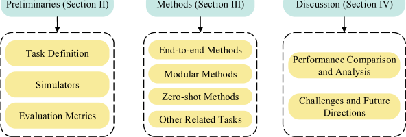

*Fig. 2. Paper Structure. The main body of the paper is organized into three sections: Section II discusses the ObjectNav definition, simulators, and evaluation metrics. Section III introduces different methods used in ObjectNav. Section IV discusses the challenges and future directions.* 

## II. PRELIMINARIES 

### A. Task Definition 

The definition of ObjectNav is to navigate to an object of a specific category in an unseen environment. Formally, we consider a set of objects _O_ = { _o_ 1 _,_ · · · _, on_ } and an agent with the action space _A_ = { _a_ 1 _,_ · · · _, ak_ }. In indoor environments, objects often include chair, bed, tv, etc., and the actions that an agent can take often include “move ahead”, “rotate right”, “rotate left”, “look up”, “look down”, and “DONE”. In an ObjectNav task _τ_ , the agent is initialized at a random position _p_ in an unseen environment _s_ . The agent is asked to find an object _o_ ∈ _O_ in _s_ with a minimum number of steps. We therefore denote each task by the tuple _τ_ = _(s, o, p)_ . The inputs are RGB or RGB-D images with or without the agent’s real-time positions. The agent learns a policy and outputs actions _a_ ∈ _A_ at each step. 

### B. Simulators

Some simulators have been proposed to facilitate the Embodied Navigation tasks, like Habitat Sim [84], AI2THOR [85], and Gibson Env [86]. Among them, Habitat Sim and AI2-THOR are the two main platforms for the ObjectNav task. In this section, we will introduce these two platforms in detail. Fig. 3 shows example scenes in the two simulators. Table I is a brief comparison of these two simulators. 

**TABLE I. COMPARISON OF HABITAT SIM AND AI2-THOR SIMULATORS. WE GIVE A COMPARISON OF THESE TWO MAIN SIMULATORS IN THE IMAGE, DATASETS, AGENT INPUTS, AND ACTION SPACE** 

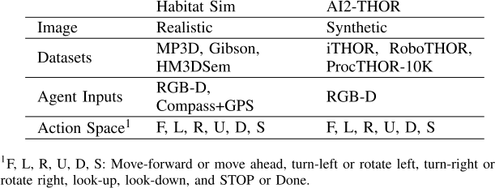

#### 1) Habitat Sim

Habitat Sim is a flexible and highperformance 3D simulator that consists of configurable agents, sensors, and 3D datasets. It uses the Matterport3D (MP3D) [87] and Gibson [86] datasets, which are scans of large scenes, to render out photo-realistic views. Habitat Sim provides an API layer to allow developing embodied AI for tasks like ObjectNav. Now Habitat Sim has been extended to interactive 3D environments (Habitat 2.0) for some interactive tasks, like Rearrangement [88]. In this paper, we mainly focus on Habitat Sim. Based on this simulator, the Habitat ObjectNav Challenge has been held every year since 2019. 

In Habitat Challenge from 2019 to 2021, MP3D consisting of scans of 90 indoor spaces is used, with a standard 61/11/18 split for training, validation, and testing, as described by Chang et al. [87]. 21 object categories from the 40 annotated ones in MP3D are selected. Using this environment, episodes are generated, and are defined by the unique ID of the scene, the starting position and orientation of the agent, and the goal category label for the ObjectNav task. Building on the top of Habitat-Matterport 3D Dataset (HM3D) [89], Habitat-Matterport 3D Semantics (HM3DSem) v0.1 [90] with 120 scenes and Habitat-Matterport 3D Semantics (HM3DSem) v0.2 [90] with 216 scenes are used for the challenge in 2022 and 2023, respectively. Fig. 3(a) gives an example of the scene used in Habitat Sim. 

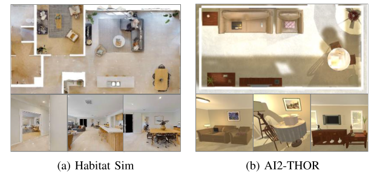

*Fig. 3. Examples of Scenes in Habitat Sim and AI2-THOR. We show some RGB images of one scene used in each simulator.* 

The agent is modeled as an idealized cylinder of radius 0.18 m and height 0.88 m. It is equipped with an RGB-D camera and a GPS+Compass sensor. Specifically, the RGB camera has a 79◦ horizontal field of view with a resolution of 640 × 480, and the depth camera is clipped from 0.5m to 6m. The GPS+Compass sensor provides relative positions ( _x_ , _y_ , _z_ ) and heading (angle) information with regard to the starting position (origin) and heading (0◦ ). The action space of the agent includes “move-forward 0.25m”, “turn-left 30◦ ”, “turn-right 30◦ ”, “look-up 30◦ ”, “look-down 30◦ ” and “STOP”. 

#### 2) AI2-THOR

AI2-THOR is an interactive simulator that consists of near photo-realistic indoor scenes. It provides a Python API for users to perform interactions with the objects in the rooms. Currently, iTHOR and RoboTHOR are the two main datasets used in ObjectNav on the AI2-THOR platform. iTHOR is the original set of scenes, including 120 scenes covering bedrooms, bathrooms, kitchens, and living rooms. RoboTHOR consists of 89 maze-styled dorm-sized apartments to study sim2real transfer, which is also the dataset used in the RoboTHOR Challenge for the ObjectNav task. Developed from AI2-THOR, Deitke et al. [91] propose a framework, ProcTHOR, to procedurally generate a larger dataset named ProcTHOR-10K, which is also used in ObjectNav lately. 

In the RoboTHOR Challenge, there are 89 scenes in total: 75 simulated scenes used for training, 4 real/simulated scenes used for validation, and 10 real scenes used for the challenge. There are 43 object categories: 11 classes of furniture and 32 classes of small objects. 12 of these categories are used as test targets. In iTHOR, as shown in Fig. 3(b), there are four scene categories: kitchens, living rooms, bedrooms, and bathrooms, and each category has 30 scenes. In each category, the first 20 scenes are used for training. The next five scenes are used for validation, and the last five scenes are for testing. The physical robot used is a LoCoBot equipped with an Intel RealSense RGB-D camera. Different from Habitat Sim, they only use RGB-D images without position sensors. Its action space is: “move ahead”, “rotate right”, “rotate left”, “look up”, “look down”, and “DONE”. 

### C. Evaluation Metrics

Four main metrics have been used for the ObjectNav task: Success Rate (SR), Success-weighted Path Length (SPL), Soft SPL, and Distance to Success (DTS). 

**Success Rate (SR)** is the ratio of episodes that count as a success. As long as the agent executes the “STOP” or “DONE” action and the distance to the target (any instance of the category) is within a threshold (e.g., 1m in Habitat Challenge), this episode counts as a success. 

**Success-weighted Path Length (SPL)** is the metric to evaluate the efficiency of the agent’s navigation. It uses a comparison between the optimal path and the agent’s path. 

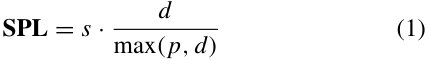

where _s_ is 1 if the agent finds any instance of a target, otherwise _s_ is 0. _d_ is the geodesic distance of the shortest path, and _p_ is the distance traveled by the agent. When _s_ is 0, SPL will be 0. Otherwise, SPL is in the range of 0 to 1, and a larger SPL means higher efficiency (i.e., shorter path to success). 

**Soft SPL** is a softer version of SPL that measures efficiency based on the progress towards the goal (even with 0 success). 

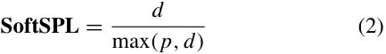

**Distance to Success (DTS)** is the geodesic distance of the agent to the goal at the end of the episode. It measures how long the agent needs to navigate to reach the target when it stops. 

## III. METHODS IN OBJECTNAV 

In this section, we group current works in ObjectNav into three categories: end-to-end methods, modular methods, and zero-shot methods Fig. 4 shows the development timeline of these methods and summarizes their main research concerns. We also list the works in ObjectNav on the website.1 

1 <https://github.com/jws39/awesome-objectnav> 

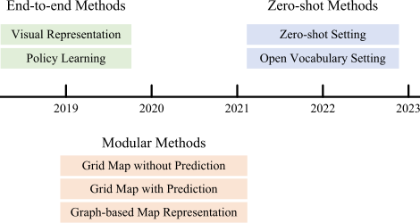

*Fig. 4. Research Directions. We show the development timeline of methods in ObjectNav and their main research concerns.* 

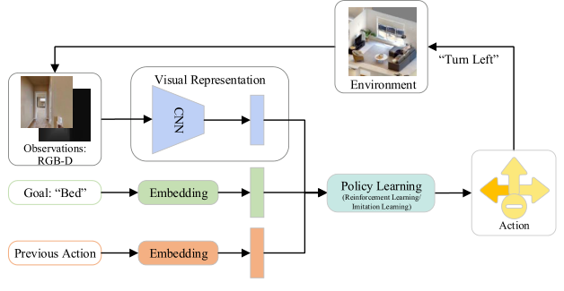

*Fig. 5. The Framework of End-to-end Methods. In this framework, the agent first encodes the observations to extract features as a visual representation and embeds the goal and previous action for the policy network input. The policy network then learns the action decision-making based on the reward by interacting with the environment.* 

### A. End-to-End Methods

As shown in Fig. 5, end-to-end methods map the observations to actions directly using reinforcement learning (RL) or imitation learning (IL). In this framework, the agent first encodes the observations to extract features as a visual representation and embeds the goal and previous action for the policy network input. The policy network then learns the action decision-making based on the reward by interacting with the environment. Visual representation and policy learning are two main parts of this framework. In this section, we will summarize existing works and group them into two subcategories in terms of their focuses: 1) to improve visual representation for better scene understanding, and 2) to solve problems in policy learning such as sparse reward and overfitting. We also summarize these works in Table II. 

#### 1) Visual Representation

Visual representation is important for agent navigation. It aims to extract useful information from the observations to help the agent understand the environment. Early works [7], [8] only combine different visual representations, including raw RGB-D images, object detection bounding boxes, and semantic segmentation masks as inputs of the policy network. Instead of combining different visual representations for a single policy network, Shen et al. [9] utilize different visual representations as the inputs of different policies and then fuse actions from the policies. Yadav et al. [34] first learn the visual representation from large-scale images of indoor environments using self-supervised learning. Then the pre-trained visual encoder is fine-tuned with image augmentations and then used in the ObjectNav task. 

Despite directly using the raw images, object detection, and semantic segmentation results, some works further investigate relationship information, such as the relationship between objects and regions, to enhance the visual representation. This idea comes from human navigation behaviors in which humans can use some relationship information (e.g., the layout of a specific room and the co-occurrence of some objects). To explore the use of such relationships, some works have proposed different ways to represent them. Du et al. [10] propose an object relation graph for simultaneously encoding category closeness and spatial correlations from object detection information during training. Instead of constructing a graph, 

Druon et al. [11] use a context grid to represent the relationship information. In this context grid, the relationship is represented by the similarity score between the target and detected objects, which are computed using the word-embedding feature of the object class. Campari et al. [12] design a scene-specific joint representation to explore the scene-object relationship. They associate the goal with a specific room by combining the scene feature of the current observation with the goal feature. Yan et al. [13] design an 8-D spatial context vector to integrate the spatial and relationship information that contains the detected objects’ categories and positions and the similarity between them and the target. 

The works mentioned above only explore relationship information residing in the environment itself. Some other works extract relationship information among objects, regions, or rooms from other datasets (mainly Visual Genome [92]) [14], [15], [16], [17], [18], [19], [20] and then integrate this prior knowledge with current observations. Yang et al. [14] first introduce the prior knowledge of relationships among objects using a graph in ObjectNav. They first count the occurrence of object pairs in the Visual Genome dataset [92] and set the objects as nodes and the occurrence frequency as edges. Then a Graph Convolutional Network (GCN) [93] is used to integrate this prior knowledge with observations to guide navigation. Pal et al. [16] also use a graph to represent prior knowledge from the Visual Genome dataset. The difference is that they not only represent the object category in a node but also the object position and the similarity between the object and target using a novel context vector. Zhou et al. [18] specify the spatial relations between objects in terms of their relative directions (in, on, over, under, in front of, behind, left of, and right of). Zhang et al. [20] consider the object-to-zone relationship in the visual representation. They propose a hierarchical object-tozone (HOZ) graph composed of scene nodes, zone nodes, and object nodes to do the ObjectNav in a coarse-to-fine manner. 

Because of the excellent performance of the transformer in some vision tasks, like object detection, segmentation, and video understanding [94], some works [12], [13], [21], [22], [23], [24] apply the attention mechanism and transformer in ObjectNav. Mayo et al. [21] introduce an attention mechanism that consists of target, action, and memory attention models to encode semantic and spatial information of observed objects. Based on the work [21], Lyu et al. [35] incorporate a global and local knowledge graph to capture global prior information and local relationship to enhance the attention modules. Du et al. [22] employ a visual transformer to encode the relationship among detected objects and their spatial correlations of current observations. In another work, Fukushima et al. [23] use a transformer to extract long-term scene and object semantic information from sequential observations to help with navigation. Their work is the first work to consider long-term memory in ObjectNav. Dang et al. [24] point out that in previous works the agent may not treat all items equally when extracting relationships between objects because of the different visibility of each object in an image. So they propose a directed object attention (DOA) graph to balance the agent’s attention on different objects. 

**TABLE II**
SUMMARY OF END-TO-END METHODS. WE SUMMARIZE WORKS IN END-TO-END METHODS WITH SOME BASIC INFORMATION AND SOME HIGHLIGHTS 

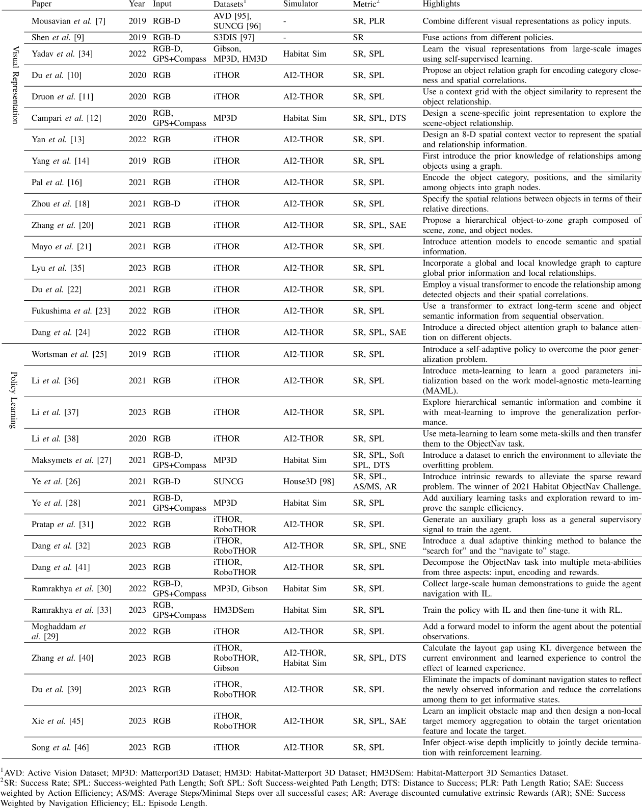

#### 2) Policy Learning

Policy learning aims to learn how to map the visual representation to actions by interacting with the environment. End-to-end methods use the RL or IL framework to learn the policy network. However, it has some problems including poor generalization or overfitting, sparse reward, and sample inefficiency. Researchers have explored different ways to solve these problems. 

To overcome the poor generalization or overfitting problem, meta-learning, known as learning to learn, is also introduced to improve the robustness of navigation policy by quickly adapting the policy to a new scenario. Wortsman et al. [25] propose a meta-reinforcement learning approach for navigation, where the agent learns to adapt through a self-supervised interaction loss. It can adapt in testing when supervision is not available. In this way, the agent can learn as it performs, which differs from traditional reinforcement learning. Li et al. [36] propose to learn a good parameters initialization based on the work model-agnostic meta-learning (MAML) [99]. In this work, they use the knowledge graph built from the Visual Genome dataset. After that, They [37] further explore hierarchical semantic information represented by a context vector and combine it with meta-learning to improve the generalization performance. Li et al. [38] use meta-learning to learn some meta-skills quickly with a small amount of unannotated data and then transfer the learned meta-skills to the ObjectNav task. Maksymets et al. [27] first point out that overfitting is the crucial reason for the poor performance. So they introduce the Treasure Hunt Data Augmentation (THDA) method, which inserts 3D scans of objects at arbitrary locations to enrich the environment. 

In the RL setting, sparse reward is a well-known problem and is also posing challenges to ObjectNav. In ObjectNav, the agent only gets high rewards when it reaches the final goal, which is a small subset of the states. The agent struggles to learn the policy because it is hard to sample the few rewarding states. To tackle the sparse reward challenge in navigation, Ye et al. [26] propose a hierarchical policy, HIEM, which adds sub-goal rewards instead of relying on a single final goal reward to alleviate this sparse reward problem. Another problem of RL setting is sample inefficiency. The work in PointNav, DD-PPO [100], shows the excellent learnability of RL in PointNav, but it requires 2.5 billion frames of experience, which is quite sample-inefficient. The work in PointNav [101] adds some auxiliary learning tasks to the DD-PPO, which is 5.5× better sample-efficiency. Based on this advance, Ye et al. [28] add three new tasks to improve sample-efficiency: two are for learning an inverse dynamics model, and one is for predicting map coverage. They also add an exploration term to reward the agent to explore. Their work won the 2021 Habitat Challenge. Singh et al. [31] also encode a scene graph and utilize an auxiliary graph loss as a general supervisory signal to train the ObjectNav agent. 

Some works solve ObjectNav by dividing the needed abilities into different stages or sub-skills. Dang et al. [32] decompose the ObjectNav task into two stages, the “search for” stage and the “navigate to” stage. They think current works neglect the “navigate to” stage. So they propose a dual adaptive thinking (DAT) method that consists of search 

and navigation thinking modules to balance these two stages. Furthermore, Dang et al. [41] decompose the ObjectNav task into multiple meta-abilities from three aspects: input, encoding and rewards. They then select five meta-abilities: intuition, search, navigation, exploration, and obstacle, with corresponding inputs, encoding networks, and designed rewards for ObjectNav. Similarly, some works [42], [43], [44] split the abilities needed in ObjectNav into sub-skills (e.g., exploration and navigation) and then design a skills selection module or high-level policy to switch between them. 

Some works also explore other ways in terms of policy learning to improve ObjectNav performance. Ramrakhya et al. [30] collect a large-scale dataset and use it to explore how large-scale imitation learning (IL) compares to reinforcement learning (RL). Their results show that a single human demonstration appears to be worth ∼ 4 agentgathered ones. Later, they propose an approach, PIRLNav [33], for first training the policy with IL to provide a reasonable start and then fine-tuning it with RL. Moghaddam et al. [29] point out that end-to-end state-of-the-art works are model-free, which means these methods lack a forward model to inform the agent about the potential observations after its actions. To address this, they propose a forward model that can predict a representation of a future state. Zhang et al. [40] propose that the agent should keep the positive effect and remove the negative effect of learned experience in training. So they propose to calculate the layout gap using Kullback-Leibler (KL) divergence between the current environment and learned experience to control the effect. Du et al. [39] point out that the high correlation among navigation states causes navigation inefficiency (e.g., stuck or trapped in a loop). So they first eliminate the impacts of dominant navigation states to reflect the newly observed information and then reduce the correlations among navigation states to get informative states. Xie et al. [45] focus on improving the robustness of obstacle avoidance. They first learn an implicit obstacle map based on historical experience, and then design a non-local target memory aggregation to obtain features of the target orientation and locate the target. Song et al. [46] point out that deep reinforcement learning methods using RGB only without depth information often struggle with optimal path planning and fail termination recognition. So they design a termination policy to infer object-wise depth information implicitly and jointly decide termination with reinforcement learning. 

Some works also allow interaction with humans to make the ObjectNav agent more performant and reliable. Singh et al. [102] introduce human assistance to give the agent the next optimal action when it asks for help. They propose the Ask4Help policy to balance the task performance and the amount of requested help without modifying the original agent’s parameters. Instead of giving the next optimal action when the agent requests help, Zhang et al. [103] give the agent an object-in-view observation containing the ground truth semantic segmentation of the target object’s location in the agent’s view. 

#### 3) Discussion

For the end-to-end method, most works mainly focus on the visual representation for better scene understanding. Some early works use the detected objects and segmentation results from RGB images directly. Then some works extract further information between the detected objects, such as the object-to-object relationship and the object-to-region relationship. We humans can easily transfer prior knowledge from known environments (e.g., the layout of our own house) to a new environment. Inspired by this, some works first extract such prior knowledge and then combine it with the current observation of the agent as the input of the policy network. Some works also use the attention mechanism to extract useful semantic information. Other than the focus on visual representation, some researchers focus on problems of policy learning to improve agent navigation performance. Some works introduce meta-learning to solve poor generalization or overfitting problems. Some works try to solve the sparse reward and sample efficiency problem of RL. Some works decompose the ObjectNav into two stages or sub-skills. Other works explore different methods in policy learning, like exploring large-scale imitation learning, adding a forward model, balancing the positive and negative effects of learned experience, improving the robustness of obstacle avoidance, and designing a termination policy. 

End-to-end methods directly learn the whole navigation system and do not need to build and maintain a map, which is quite straightforward. Current works have explored visual representation and policy learning deeply, but the end-to-end methods still have a long way to go to be applicable in real application. Overall, these methods are straightforward but difficult to learn, because they need to learn localization, mapping, and path planning together. In addition, there is a sim-to-real gap. The agents are trained in simulators. Due to the fidelity of simulators, the observations in simulation environments are very likely to be different from the real world. Moreover, the end-to-end learning methods using reinforcement learning or imitation learning require significant computational resources and time [28], which is also a problem for real-world applications. To address these limitations, researchers also explore modular methods. 

### B. Modular Methods 

Rather than studying the whole system in an end-to-end way, modular methods usually consist of a mapping module, a policy module, and a path planning module, as shown in Fig. 6. The agent first encodes the observations to extract features. And it also utilizes the mapping module to build a map or graph to represent the environment. Then the features from observations and the built map or graph are both used in the policy module to generate a long-term goal. Finally, the path planning module takes the long-term goal as the input and outputs the next action. In this framework, the mapping module is vital and has great influence on the subsequent decision-making. So we group the modular methods into two subcategories in terms of map representation: grid map representation and graph-based map representation. For methods using grid maps, they can be further grouped into grid maps without prediction and grid maps with prediction, based on if the agent relies on only the current observed map or the predicted grid map. We also summarize these works in Table III. 

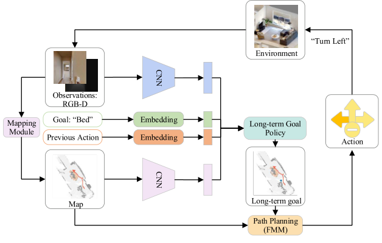

*Fig. 6. The Framework of Modular Methods. In this framework, the agent first encodes the observations to extract features. And it also utilizes the mapping module to build a map or graph to represent the environment. Then the features from observations and the built map or graph are both used in the policy module to generate a long-term goal. Finally, the path planning module takes the long-term goal as the input and outputs the next action.* 

#### 1) Grid Map Without Prediction

Works using grid maps explicitly or implicitly project the partially observed 3D environment onto a top-down 2D grid map. Gupta et al. [47] first propose a navigation network that consists of mapping and planning modules. They encode the first-person images into neural representations implicitly and integrate the representations into a latent memory, which corresponds to an egocentric map of the top-down view of the environment. Then the planning module uses this map to output navigation actions. Chaplot et al. [48] first introduce a three-module framework with an explicit top-down semantic grid map, which heavily influenced following works. The mapping module uses MaskRCNN [104] first to get the 2D semantic segmentation from the current frame and then projects the segmentation to a top-down semantic grid local map, which is accumulated to get a global semantic grid map. Then the policy module uses the top-down semantic grid local and global maps as inputs and predicts the next long-term goal. The path planning module uses the FMM [105] to plan a path to the longterm goal. Their work won the 2020 Habitat ObjectNav Challenge. Luo et al. [49] also use a semantic top-down grid map borrowed from [48]. In contrast to previous modular methods using trained policies, they just set one of the corners of the map as a long-term goal and get impressive results. Zhang et al. [51] not only use the top-down semantic map but also first take the 3D point scene representation as the inputs of the policy. Using these two representations, they develop two policies to predict corner and target goals, respectively. Rudra et al. [50] do the ObjectNav with a given 2D occupancy grid map. They first sample some vantage points on the map and compute the probability of spotting the target at these vantage points. Then, they consider the agent’s start position, the room layout, and the probability of spotting targets to generate the navigating order to these points. 

#### 2) Grid Map With Prediction

Previous works only use the grid map that has been observed so far as the policy input. However, these observed maps are incomplete and often have occlusions due to the robot’s limited field of view. 

**TABLE III**
SUMMARY OF MODULAR METHODS. WE SUMMARIZE WORKS IN MODULAR METHODS WITH SOME BASIC INFORMATION AND SOME HIGHLIGHTS 

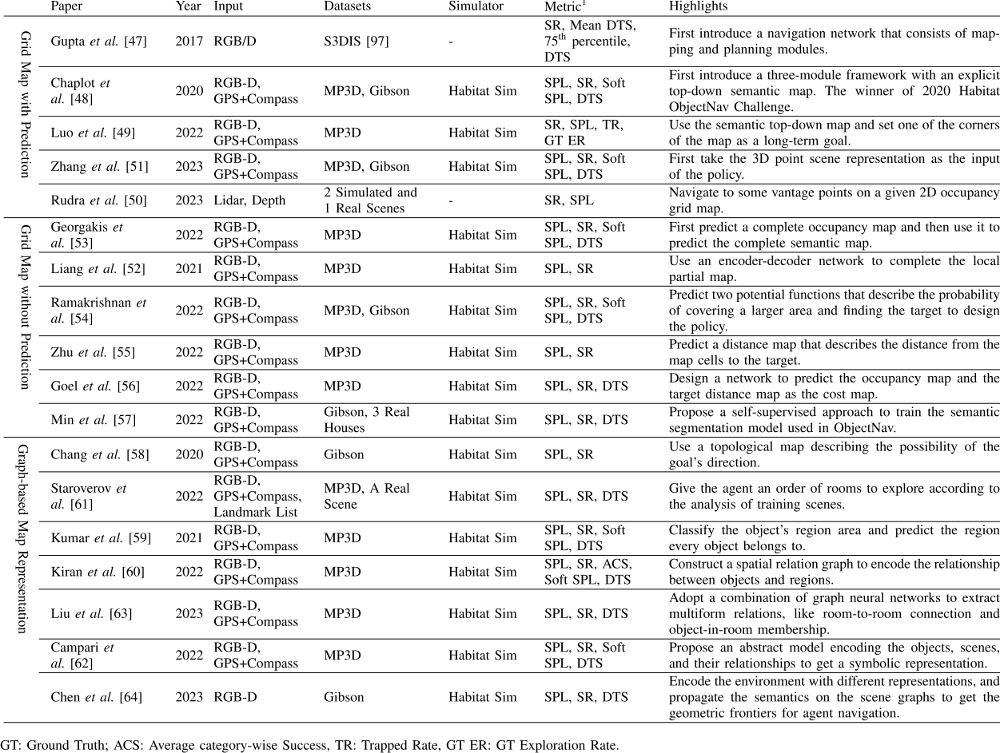

To solve this problem, some researchers propose to predict the complete map and/or predict where the target will appear before inputting into the policy module. Georgakis et al. [53] first predict a complete occupancy map from the accumulated partial occupancy map and then combine the semantic segmentation of the current view with it to predict the complete semantic map. Both predictions are carried out using encoderdecoder networks. Then they use the predicted semantic map to design the policy to get the next goal and employ the DD-PPO [100] model to reach the goal. Liang et al. [52] first use an encoder-decoder network to complete the local partial map with semantic labels for the unobserved scene and also use another network to predict the confidence of the predicted complete map. Then they use the complete semantic map and its confidence map as inputs of a policy network to generate the next action. Experiment results show that the predicted map with confidence can help improve the ObjectNav performance by 5.3%/3.9% SR/SPL. 

Rather than predicting a complete map, some works directly predict the probability of the position or area of the target. Ramakrishnan et al. [54] disentangle the ObjectNav task into two parts: “where to look?” and “how to navigate to ( _x_ , _y_ )?”. 

They focus on the first part and treat it as a pure perception problem by predicting two potential functions that describe the probability of covering a larger area and finding the target, respectively. Then the predicted potential functions are used to design a policy to generate a long-term goal. Zhu et al. [55] predict a distance map from a top-down semantic map that describes the distance from the map cells to the target based on prior knowledge. Then they use the predicted distance map to design a policy to generate the long-term goal for path planning. In the 2022 Habitat Challenge, they combine this modular method with an end-to-end method [30] using a switch strategy considering different conditions. Their work won the challenge in 2022. Goel et al. [56] design a network to predict the occupancy map and the target distance map as the cost map. Then the cost map is used to generate continuous robot actions. Min et al. [57] point out that current works depending on labeled 3D meshes may hinder the transfer of the ObjectNav to the real world. So they propose a self-supervised approach to train the semantic segmentation model using local consistency as a supervision signal. Based on the PONI [54] framework, they apply the segmentation model to the ObjectNav task in the real world. 

#### 3) Graph-Based Map Representation

Despite using a top-down grid map, some works explore other formats to represent the environment (e.g., a topological map or a graph). Chang et al. [58] point out that we humans can leverage common sense patterns in the environment’s layout from experience. So they use a topological map describing the possibility of the goal’s direction and learn it from videos. Then they use the topological map to get a possible direction and a long-term goal, and finally use the FMM to reach the long-term goal. Staroverov et al. [61] analyze training scenes to relate object types to room types and then use this information to give the agent an order of rooms to explore the environment. Then they use another three trained basic skills (i.e., navigation to the point, exploration of the nearby area, and reaching the seen object) to construct the hierarchical navigation system. 

Some works use a graph to represent semantic information and use it directly in the navigation system. Kumar et al. [59] first construct an object graph and use a region classification network to predict the region every object belongs to. Then they count the probability of a goal occurring in all the region classes. Using the region classification network and the goal distribution probability, they can get the probability of the goal appearing in the adjacent area to each detected object and set the highest as the next long-term goal. They also propose another modular method [60] in which they construct a spatial relationship graph and use a graph convolutional network to encode the relationship between objects and regions. With the spatial relationship graph, they then introduce a Bayesian inference approach to process the observations to estimate the visible regions and select the next visible region to explore. Liu et al. [63] propose a hierarchical navigation framework, ReVoLT, in which they adopt a combination of graph neural networks to extract multiform relationships, like room-to-room connection and object-in-room membership. Using these relationship priors, the semantic reasoners adopt Upper Confidence Bound for Tree (UCT) [106], a strategy to balance exploration and exploitation, to generate a semantic sub-goal. Campari et al. [62] propose an abstract model encoding the objects, scenes, and their relationships to get a symbolic representation without unnecessary details. With this abstract model, if the target can be located within this abstract model, they can set it as the goal position. Otherwise, they will use a policy based on Active Neural SLAM [107] to generate the goal position. Based on a visual SLAM system, Chen et al. [64] propose a training-free pipeline, StructNav. They first encode the environment with point clouds, scene graphs, and semantic occupancy maps. Then the semantics are propagated on the scene graphs to get the geometric frontiers for agent navigation. 

#### 4) Discussion

Unlike end-to-end learning methods, modular methods combine the advantages of learning-based methods and the classical navigation pipeline. It usually has a mapping module to represent the environment, a policy module to generate a long-term goal, and a path planning module to navigate to the long-term goal. Early works directly use an implicit or explicit semantic grid map as the input of the policy network. Then some works use the predicted 

completed map from partial observations as the policy input. Then some researchers take this task as a pure perception task, where they do not predict the completed map but predict the potential positions or areas of the target to generate the longterm goal. At the same time, some works have also explored maps in other formats (e.g., topological maps) or represented the environment in a graph-based map representation using relational information. Unlike end-to-end methods, modular methods decompose ObjectNav into mapping, long-term goal policy, and path planning modules. The mapping module provides a domain-agnostic representation, disentangling the agent’s perceptual module from the subsequent policy and path planning modules, which makes it easier to transfer such methods to the real world. Moreover, modular methods require less computational resources and time to some extent [54]. However, most modular methods have different mapping modules with correspondingly designed policies, which are specific to different assumptions. The lack of a unified framework like end-to-end methods makes it difficult to compare the effectiveness of different mapping modules. 

### C. Zero-Shot Methods

Zero-shot learning is a paradigm in which the model is made to generalize to novel classes with zero training samples. For example, in zero-shot image classification, the model is capable of classifying the unseen classes in the test data without seeing them in the training data. Apart from image classification, zero-shot learning has been applied to the fields of object detection and image segmentation and achieved impressive performance [69]. In ObjectNav, zero-shot methods refer to navigating to unseen targets that are only available in testing. So far, there is no unified definition for the existing works. Zero-shot methods use a zero-shot learning manner to solve ObjectNav, so they can use the frameworks of end-to-end or modular methods. According to the slight difference in task settings, we follow the work [69] to group existing works into two categories: zero-shot setting and open vocabulary setting. In the zero-shot setting, seen target classes are available during the training, while unseen target classes are only available during the testing. In the open vocabulary setting, there is no split between seen target classes and unseen target classes for training and test sets. Instead, Vision Language Models (VLMs) and Large Language Models (LLMs) are directly used to provide prior knowledge about unseen target objects, which allows zero-shot learning in the open vocabulary setting. As shown in Table IV, we summarize the zero-shot ObjectNav methods in both categories. 

#### 1) Zero-Shot Setting

Zhao et al. [69] point out that overfitting on seen classes in training is a core problem in the zero-shot setting. In order to alleviate this problem, they use the detection results of seen and irrelevant classes and their similarity scores with the target as policy inputs. Then they use a self-attention module to learn the relationship between each pair of classes. In the testing process, through the learned relationships, the agent can generate the ability of navigation to the unseen target classes. Zhang et al. [70] point out that the key challenge of zero-shot setting is how to generate unseen object representations within its current environment in testing. They 

**TABLE IV**
SUMMARY OF ZERO-SHOT METHODS. WE SUMMARIZE WORKS IN ZERO-SHOT METHODS WITH SOME BASIC INFORMATION AND HIGHLIGHTS 

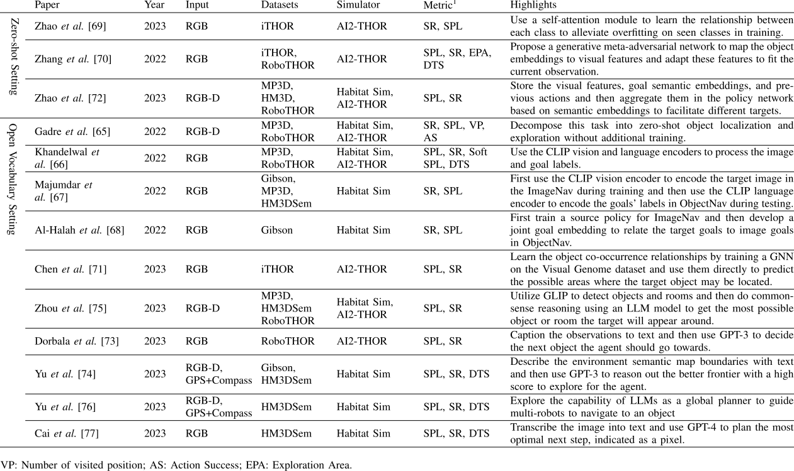

propose a generative meta-adversarial network that consists of a feature generator to map the object embeddings to visual features and an environmental meta-discriminator to adapt the visual features to fit the current observation. Zhao et al. [72] explore how to use the historical information. They store the visual features, goal semantic embeddings, and previous actions at each step and then aggregate them in the policy network based on semantic embeddings to facilitate different targets. 

The above three works try to solve the ObjectNav in the strict zero-shot setting from different perspectives (i.e., alleviating the overfitting on seen classes, generating unseen object representations, and using historical information). However, there is no standard training or test setting. They use their own split of the seen and unseen targets on different datasets (e.g., iTHOR, RoboTHOR, and HM3D), which makes it hard to compare the performance of their work. 

#### 2) Open Vocabulary Setting

In the open vocabulary setting, some works use the encoding ability of the visual and language information in VLMs to help the agent understand the environment better. Furthermore, other works introduce the reasoning ability of LLMs to help the agent make better decisions without learning. 

With the development of multi-modal representation learning, VLMs (e.g., Contrastive Language-Image Pre-Training (CLIP) [108]) have shown outstanding zero-shot performance of different tasks on ImageNet. Recently, some researchers have applied CLIP to ObjectNav. Gadre et al. [65] propose 

CoWs, which decomposes this task into zero-shot object localization and exploration without additional training. CoWs first uses CLIP to pair images and goals’ labels and uses a gradient-based object localization method to get the detailed spatial positions of goals. Then it integrates the zero-shot object localization with the frontier-based exploration to do the ObjectNav. Khandelwal et al. [66] propose EmbCLIP, which uses the vision and language encoders of CLIP to process the image and goal labels, respectively. EmbCLIP uses the representations from CLIP as inputs and trains a policy network with a few learnable parameters. Unlike the previous work, which directly applies the CLIP encoders to the observed images and goals’ labels, Majumdar et al. [67] propose ZSON. ZSON first uses the CLIP vision encoder to encode the target image in the ImageNav [109] task using an RL framework during training. Then it replaces the CLIP vision encoder with the language encoder to encode the goals’ labels in ObjectNav during testing. Similarly, Al-Halah et al. [68] propose ZESL. ZESL first trains a source policy for ImageNav from scratch. Then it develops a joint goal embedding to relate various target goal types to image goals. The joint goal embedding enables reusing the policy learned from ImageNav to address ObjectNav in a zero-shot manner. Chen et al. [71] first learn the object co-occurrence relationships by training a GNN on the Visual Genome dataset. Then the learned relationships are used directly to predict the possible areas where the target object may be located for ObjectNav without modeling any relationships in a new environment. 

In addition to introducing the pre-trained VLMs to help the agent understand the environment, some works also use LLMs (e.g., GPT-3 [110] and GPT-4 [111]) to help decision-making. Zhou et al. [75] propose ESC, which utilizes a pre-trained vision-and-language grounding model, GLIP [112], to detect objects and rooms. Then ESC does commonsense reasoning using an LLM model, Deberta v3 [113], to get the most possible object or room the target will appear around. Dorbala et al. [73] propose the Language-Driven Zero-Shot Object Navigation (L-ZSON) task, in which the goal is described by language. They first caption the observations to text and then use GPT-3 to decide the next object the agent should go towards. Yu et al. [74] propose L3MVN, which describes the environment semantic map boundaries with text and then uses GPT-3 to reason out the better frontier with a high score to explore for the agent. They [76] further propose Co-NavGPT to explore the capability of LLMs as a global planner to guide multi-robots to navigate to an object. Cai et al. [77] propose PixNav to use the capability of LLMs to complete the lastmile navigation. PixNav first transcribes the image into text and uses GPT-4 to plan the most optimal next step, indicated as a pixel. 

#### 3) Discussion

In summary, the works with the zero-shot setting are more focused on exploring how to alleviate the overfitting problem, generate unseen object features in new environments, and use historical information. While the works using the prior knowledge of pre-trained VLMs and the reasoning ability of LLMs help get better visual features and make better decisions for the agent. The zero-shot methods provide a way to solve the problem where new objects are encountered in real-world applications, and are good supplements to end-to-end and modular methods where only pre-defined objects are considered. However, there is a relatively small amount of research in this direction. More research and exploration are expected in the future. 

### D. Other Related Tasks

In this section, we will introduce two more challenging related tasks, Multi-Object Navigation (MultiON) [114] and Instance-level Object navigation (ION) [121]. In MultiON, the agent is asked to navigate to an ordered sequence of objects (1-3 objects) in an unseen environment. It requires the agent to remember the targets it has seen and navigate to the targets in a fixed order. In ION, the agent has to navigate to an instance-level object with a specific color and material. MultiON and ION tasks are more challenging than the ObjectNav. MultiON deals with multiple objects, while ION deals with specific objects. There are not so many works till now. Research on these two tasks will help to improve the intelligence of the agent. 

#### 1) MultiON

Wani et al. [114] propose the MultiON task and hold the MultiON Challenge2 to promote the research of long-horizon navigation. In [114], the effectiveness of different map representations are tested in an end-to-end learning framework. It is found that the agent using a simple semantic map performs better than the agent using a complex map with neural features. 

2 <https://multion-challenge.cs.sfu.ca/2021.html> 

Kim et al. [115] propose a framework consisting of a classical SLAM system, a target detection module, and a policy. If the target is not detected, the agent just explores the environment using the Frontier-based Exploration (FBE) policy. Otherwise, the agent utilizes the D* [122] path planner to approach the detected target. Their method ranked 2nd place in the 2021 Multi-ON Challenge without using any learning modules. Chen et al. [116] point out that humans turn their heads to look around with curiosity when walking in a new environment. So they propose a camera policy for the agent to look around and combine it with the existing navigation policy to improve the efficiency of exploration. In the study of human spatial navigation [123], researchers point out that the sense of direction and the judgment of relative distance is very important to human navigation. Inspired by this idea, Marza et al. [117] combine existing MultiON methods with three auxiliary tasks (i.e., to predict whether the target has been seen, the direction to the target, and the distance to the target). Their method won the 2021 Multi-ON Challenge. Recently, implicit representations have had an impressive performance in novel view synthesis [124] and the potential in representations for robotics [125]. Inspired by this, Marza et al. [118] propose two implicit representations: the Semantic Finder to predict the positions of the targets and the Occupancy and Exploration Implicit Representation to map the environment to 2D occupancy information. Such representations have advantages without considering the explicit format of the map. Slightly different from the definition of MultiON [114] in previous works, Schmalstieg et al. [119] propose MultiON in continuous action space and remove the requirement for the agent to navigate to the targets in a fixed order. They propose a predictive module to predict the direction of the closet target using the encoding of the semantic map and previous states. They take this direction prediction as the agent’s long-horizon intention. 

#### 2) ION

Li et al. [121] extend ObjectNav to Instance Object Navigation (ION), where the agent is required to navigate to an instance-level object with a given instance-level description, like colors and materials. To solve this more challenging task, they propose a navigation module based on an instance-level relation graph to encode the representations of colors, materials, and locations. Then they use an instance grounding module to select the final instance prediction from several ground truth candidates provided by the simulator. 

**TABLE V**
OTHER RELATED TASKS. WE SUMMARIZE WORKS IN MULTION AND ION TASKS WITH SOME BASIC INFORMATION AND SOME HIGHLIGHTS 

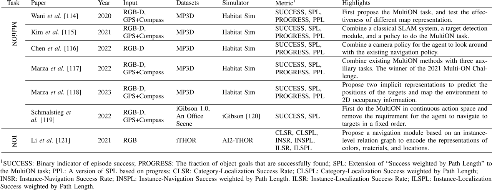

**TABLE VI**
PERFORMANCE ON HABITAT OBJECTNAV CHALLENGE 2021. WE COMPARE THE PERFORMANCE OF WORKS DONE IN THE HABITAT OBJECTNAV CHALLENGE 2021 

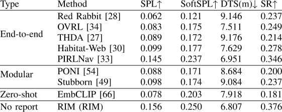

## IV. DISCUSSION 

In this section, we first summarize the performance of ObjectNav on the two mentioned simulators and analyze some failure modes. Then, we discuss challenges faced in ObjectNav and potential future directions. 

### A. Performance Comparison and Analysis

#### 1) Performance on Habitat Sim and AI2-THOR

We summarize the distribution of the existing works on Habitat Sim and AI2-THOR as in Fig. 7. The basic information and highlights can also be found in Table II, III, and IV. We find works focused on visual representation in the end-to-end method are mainly done on AI2-THOR. And modular methods are mostly evaluated on Habitat Sim. We think the reason is that the AI2-THOR simulator provides the RGB-D images as inputs, and the Habitat Sim provides not only the RGB-D images but also the GPS+Compass, which makes it easier to build the map. 

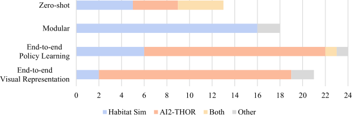

*Fig. 7. Papers on Habitat Sim and AI2-THOR. We count the number of works done in these two simulators.* 

For the works tested in Habitat Sim, some perform the validation set in their way, and a few give the results on the Habitat ObjectNav Challenge. So for a fair comparison, we only show the performance of works that have published the results on 

Habitat ObjectNav Challenge 2021 Leaderboard3 and Habitat ObjectNav Challenge 2022 Leaderboard.4 We do not show the results on Habitat ObjectNav Challenge 2023 Leaderboard5 which only has results of three works. We show the performance of works before 2021 using the MP3D [87] and in 2022 using the datasets HM3DSem [90] in Table VI and Table VII, respectively. 

In the Habitat ObjectNav Challenge before 2021, there are 21 categories of objects in the environment. And in the test split, the target object for the agent to navigate to is from the same 21 categories. In Table VI, PIRNav achieved the best performance with 0.145 SPL, 0.237 SoftSPL, 0.346 SR, and 6.951 DTS in the end-to-end methods. The RIM without any report achieved the best results with 0.156 SPL, 0.250 SoftSPL, 0.376 SR, and 6.807 DTS. 

In the Habitat ObjectNav Challenge in 2022, another dataset, HM3DSem, is used. This dataset has higher visual fidelity and fewer artifacts than MP3D. The targets are from 6 categories of objects. There are also two test phases: the Test-Standard phase for establishing the state of the art (SOTA) and the Test-Challenge phase to decide the winner. As shown in Table VII, ByteBOT, which is based on the work [55], has the best results with 0.35 SPL, 0.38 SoftSPL, 0.64 SR, and 3.19 DTS. Currently, there is no report for this method and only the presentation. From the presentation, they combine their modular work with the end-to-end work [30] to do the ObjectNav. From Table VII, we can see the results in 2022 are much higher than the results in 2021 and before. We think this mainly attributes to the number of the target category. 

On the AI2-THOR platform, RoboTHOR is used for ObjectNav Challenge, while many works also use the iTHOR in their experiments. So we use the comparison results in works [32], [41] to show the performance on the AI2-THOR platform, 

> 3 <https://eval.ai/web/challenges/challenge-page/802/leaderboard/2195> 

> 4 <https://eval.ai/web/challenges/challenge-page/1615/leaderboard/3899> 

> 5 <https://eval.ai/web/challenges/challenge-page/1992/leaderboard/4705> 

**TABLE VII**
PERFORMANCE ON HABITAT OBJECTNAV CHALLENGE 2022. WE COMPARE THE PERFORMANCE OF WORKS DONE IN THE HABITAT OBJECTNAV CHALLENGE 2022 

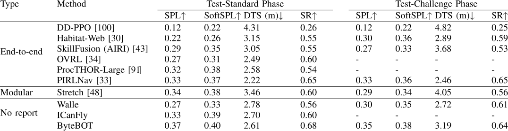

**TABLE VIII**
PERFORMANCE ON ITHOR AND ROBOTHOR DATASETS. WE COMPARE THE PERFORMANCE OF WORKS DONE IN THE ITHOR AND ROBOTHOR DATASETS 

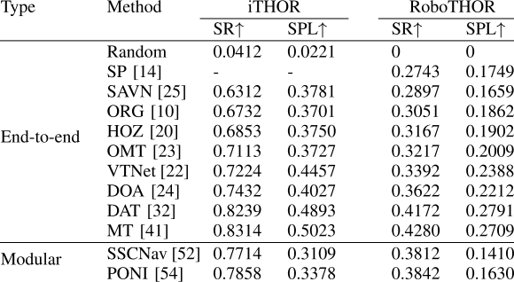

as shown in Table VIII. We can see the MT [41] achieves the best performance on both iTHOR and RoboTHOR datasets. 

The performance on iTHOR is much better than the performance on RoboTHOR. We think it is attributed to the simple environment in the iTHOR dataset, which is the single roomsized scene. The scenes in RoboTHOR are more complex and have longer navigation paths. 

The results of the Habitat ObjectNav Challenge (before 2021) are much lower than the results in AI2-THOR. We think this is because the scenes in Habitat Sim are larger, and the target number is 21, while the number in the test phase in the RoboTHOR ObjectNav Challenge is only 12. After they set the target number to 6 in the Habitat ObjectNav Challenge in 2022, there is no significant gap between the results on these two simulators. Though the performance is improving, current results show that the agent’s performance is still poor in complex environments, which makes it still far from realworld applications. 

#### 2) Analysis on Failure Modes

Many methods have been proposed to improve the ObjectNav performance in simulation environments. However, it is still far from real-world applications. Two works [28] and [49] analyze the failure modes in simulation environments, and one [126] analyzes those in both simulation and real-world environments. In this section, we summarize the analysis reported in works [49] and [126]. 

In the work [49], the authors analyze the failure modes of end-to-end and modular learning methods [28], [48] in the 

Habitat Sim environment. They find the top reason is false or missed target detection, which means the agent either detects the wrong object as the target or does not detect the target even though it is in view. The second reason is exploration, in which the agent loops over or repeats the collision in the same area and explores the wrong area to find the target. 

Gervet et al. [126] compare the classical methods, the endto-end learning methods, and the modular learning methods both in simulation and real-world environments. The results show that the classical and modular learning methods transfer better from simulation to real world than the end-to-end learning methods. There is an increase in both classical and modular learning methods from sim to real. They point out two gaps between the current simulators and the real world, which are summarized below. 

First, there is a gap in the quality and appearance of RGB images. The segmentation results trained on the simulation environment drop when tested in the real world, and vice versa. The end-to-end learning methods directly map observations to actions, so the gap significantly affects the performance. But the classical and modular learning methods first use observations to build a semantic grid map that is invariant when transferred between sim and real. This is why the modular learning methods have better sim-to-real performance than the end-to-end learning methods. 

Another gap is the failure modes of the modular learning methods between the simulator and the real world. The errors in the simulator come from the inherent visual and physical reconstruction errors, which do not happen in the real world. The errors in the real world are primarily due to depth sensor errors, such as those caused by mirror reflections. This also explains the increased performance of classical and modular learning methods in reality. 

### B. Challenges and Future Directions

#### 1) High Computational Cost

Most end-to-end and zero-shot methods and some modular methods usually implicitly learn the policy using an RL or IL framework. As a result, it requires significant computational resources and time, which makes it quite hard for real-world applications. There have been some modular methods to solve this problem. For example, PONI [54] does the ObjectNav by predicting some potential functions using supervised learning instead of RL 

to reduce computational cost. Some other works [49], [53], [60] use a designed policy rather than learning the policy to remove the time-consuming learning process. Further studies in this direction are expected to be conducted in the future. 

#### 2) Application in Real World

Many of the existing works of ObjectNav are in simulators. The work in [126] studies the classical, end-to-end, and modular learning methods both in the simulator and the real world. It finds gaps in image quality and failure modes between the simulator and the real world, which provides useful directions for research works on sim-to-real in the future. Another challenge is that we still rely on the expensive human-annotated semantic 3D mesh in the simulator. Min et al. [57] have pointed out this problem and used a self-supervision method to do ObjectNav, which could be explored further in the future. 

#### 3) Representation With 3D Information

From the perspective of visual representation, most works only use the visual representation of 2D images without considering 3D information. Though some work convert 2D depth images to 3D point clouds and then get a top-down map, they only use the top-down map in 2D without exploiting the 3D information. Zhang et al. [51] is the first work that proposes to use a 3D point scene representation as the input for policy prediction. It mainly uses 3D information to help with target identification. So one of the future directions would be to introduce 3D information into different representations and explore how the 3D information could be used to improve navigation and exploration. 

#### 4) VLMs and LLMs for ObjectNav

In zero-shot methods, the VLMs and LLMs have been applied to help the agent use the prior common knowledge and make decisions. Benefiting from large-scale pre-training, VLMs and LLMs show excellent zero-shot performance in vision and language tasks. However, the knowledge learned (e.g., semantic and spatial relationships) in VLMs and LLMs has not been thoroughly explored and applied to ObjectNav, which is also a promising direction for future research. 

## V. CONCLUSION 

We present a comprehensive survey on ObjectNav. We first give the definition of this task, and introduce the simulators, the datasets, and the metrics it uses. Then we group the works on ObjectNav into three categories: end-to-end, modular, and zero-shot methods, and discuss their advantages and disadvantages. We also introduce two other related tasks, MultiON and ION. Finally, we summarize the performances of current works and the failure modes that cause the poor performances and discuss challenges and directions for future research in this field. 

## REFERENCES 

- [1] M. M. Rayguru, S. Roy, L. Yi, M. R. Elara, and S. Baldi, “Introducing switched adaptive control for self-reconfigurable mobile cleaning robots,” _IEEE Trans. Autom. Sci. Eng._ , pp. 1–12, 2023. 

- [2] H. M. Do, K. C. Welch, and W. Sheng, “SoHAM: A sound-based human activity monitoring framework for home service robots,” _IEEE Trans. Autom. Sci. Eng._ , vol. 19, no. 3, pp. 2369–2383, Jul. 2022. 

- [3] P. Anderson et al., “On evaluation of embodied navigation agents,” 2018, _arXiv:1807.06757_ . 

- [4] B. Yamauchi, “A frontier-based approach for autonomous exploration,” in _Proc. Int. Symp. Comput. Intell. Robot. Automat. (CIRA)_ , Jul. 1997, pp. 146–151. 

- [5] J. Duan, S. Yu, H. L. Tan, H. Zhu, and C. Tan, “A survey of embodied AI: From simulators to research tasks,” _IEEE Trans. Emerg. Topics Comput. Intell._ , vol. 6, no. 2, pp. 230–244, Apr. 2022. 

- [6] D. Batra et al., “ObjectNav revisited: On evaluation of embodied agents navigating to objects,” 2020, _arXiv:2006.13171_ . 

- [7] A. Mousavian, A. Toshev, M. Fišer, J. Košecká, A. Wahid, and J. Davidson, “Visual representations for semantic target driven navigation,” in _Proc. Int. Conf. Robot. Autom. (ICRA)_ , May 2019, pp. 8846–8852. 

- [8] D. Liu, Y. Cui, Z. Cao, and Y. Chen, “Indoor navigation for mobile agents: A multimodal vision fusion model,” in _Proc. Int. Joint Conf. Neural Netw. (IJCNN)_ , Jul. 2020, pp. 1–8. 

- [9] W. Shen, D. Xu, Y. Zhu, L. Fei-Fei, L. Guibas, and S. Savarese, “Situational fusion of visual representation for visual navigation,” in _Proc. IEEE/CVF Int. Conf. Comput. Vis. (ICCV)_ , Oct. 2019, pp. 2881–2890. 

- [10] H. Du, X. Yu, and L. Zheng, “Learning object relation graph and tentative policy for visual navigation,” in _Eur. Conf. Comput. Vis._ Cham, Switzerland: Springer, 2020, pp. 19–34. 

- [11] R. Druon, Y. Yoshiyasu, A. Kanezaki, and A. Watt, “Visual object search by learning spatial context,” _IEEE Robot. Autom. Lett._ , vol. 5, no. 2, pp. 1279–1286, Apr. 2020. 

- [12] T. Campari, P. Eccher, L. Serafini, and L. Ballan, “Exploiting scenespecific features for object goal navigation,” in _Proc. Eur. Conf. Comp. Vis. (ECCV)_ . Cham, Switzerland: Springer, 2020, pp. 406–421. 

- [13] J. Yan, Q. Zhang, J. Cheng, Z. Ren, T. Li, and Z. Yang, “Indoor targetdriven visual navigation based on spatial semantic information,” in _Proc. IEEE Int. Conf. Image Process. (ICIP)_ , Jun. 2022, pp. 571–575. 

- [14] W. Yang, X. Wang, A. Farhadi, A. Gupta, and R. Mottaghi, “Visual semantic navigation using scene priors,” 2018, _arXiv:1810.06543_ . 

- [15] T.-L. Nguyen, D.-V. Nguyen, and T.-H. Le, “Reinforcement learning based navigation with semantic knowledge of indoor environments,” in _Proc. 11th Int. Conf. Knowl. Syst. Eng. (KSE)_ , Oct. 2019, pp. 1–7. 

- [16] A. Pal, Y. Qiu, and H. Christensen, “Learning hierarchical relationships for object-goal navigation,” in _Proc. Conf. Robot Learn. (CoRL)_ , 2021, pp. 517–528. 

- [17] I. B. de Andrade Santos and R. A. F. Romero, “Deep reinforcement learning for visual semantic navigation with memory,” in _Proc. Latin Amer. Robot. Symp. (LARS), Brazilian Symp. Robot. (SBR) Workshop Robot. Educ. (WRE)_ , Nov. 2020, pp. 1–6. 

- [18] K. Zhou, C. Guo, and H. Zhang, “Visual navigation via reinforcement learning and relational reasoning,” in _Proc. IEEE SmartWorld, Ubiquitous Intell. Comput., Adv. Trusted Comput., Scalable Comput. Commun., Internet People Smart City Innov._ , 2021, pp. 131–138. 

- [19] J. Guo, Z. Lu, T. Wang, W. Huang, and H. Liu, “Object goal visual navigation using semantic spatial relationships,” in _Proc. CAAI Int. Conf. Artif. Intell._ Cham, Switzerland: Springer, 2021, pp. 77–88. 

- [20] S. Zhang, X. Song, Y. Bai, W. Li, Y. Chu, and S. Jiang, “Hierarchical object-to-zone graph for object navigation,” in _Proc. IEEE/CVF Int. Conf. Comput. Vis. (ICCV)_ , Oct. 2021, pp. 15130–15140. 

- [21] B. Mayo, T. Hazan, and A. Tal, “Visual navigation with spatial attention,” in _Proc. IEEE/CVF Conf. Comput. Vis. Pattern Recognit. (CVPR)_ , Jun. 2021, pp. 16898–16907. 

- [22] H. Du, X. Yu, and L. Zheng, “VTNet: Visual transformer network for object goal navigation,” in _Proc. Int. Conf. Learn. Represent. (ICLR)_ , 2021, pp. 1–16. [Online]. Available: https://openreview. net/forum?id=DILxQP08O3B 

- [23] R. Fukushima, K. Ota, A. Kanezaki, Y. Sasaki, and Y. Yoshiyasu, “Object memory transformer for object goal navigation,” in _Proc. Int. Conf. Robot. Autom. (ICRA)_ , May 2022, pp. 11288–11294. 

- [24] R. Dang, Z. Shi, L. Wang, Z. He, C. Liu, and Q. Chen, “Unbiased directed object attention graph for object navigation,” in _Proc. 30th ACM Int. Conf. Multimedia_ , Oct. 2022, pp. 3617–3627. 

- [25] M. Wortsman, K. Ehsani, M. Rastegari, A. Farhadi, and R. Mottaghi, “Learning to learn how to learn: Self-adaptive visual navigation using meta-learning,” in _Proc. IEEE/CVF Conf. Comput. Vis. Pattern Recognit. (CVPR)_ , Jun. 2019, pp. 6743–6752. 

- [26] X. Ye and Y. Yang, “Efficient robotic object search via HIEM: Hierarchical policy learning with intrinsic-extrinsic modeling,” _IEEE Robot. Autom. Lett._ , vol. 6, no. 3, pp. 4425–4432, Jul. 2021. 

- [27] O. Maksymets et al., “THDA: Treasure hunt data augmentation for semantic navigation,” in _Proc. IEEE/CVF Int. Conf. Comput. Vis._ , Oct. 2021, pp. 15374–15383. 

- [28] J. Ye, D. Batra, A. Das, and E. Wijmans, “Auxiliary tasks and exploration enable objectgoal navigation,” in _Proc. IEEE/CVF Int. Conf. Comput. Vis. (ICCV)_ , Oct. 2021, pp. 16117–16126. 

- [29] M. K. Moghaddam, E. Abbasnejad, Q. Wu, J. Q. Shi, and A. Van Den Hengel, “ForeSI: Success-aware visual navigation agent,” in _Proc. IEEE/CVF Winter Conf. Appl. Comput. Vis. (WACV)_ , Jan. 2022, pp. 3401–3410. 

- [30] R. Ramrakhya, E. Undersander, D. Batra, and A. Das, “Habitat-web: Learning embodied object-search strategies from human demonstrations at scale,” in _Proc. IEEE/CVF Conf. Comput. Vis. Pattern Recognit. (CVPR)_ , Jun. 2022, pp. 5163–5173. 

- [31] K. Pratap Singh, J. Salvador, L. Weihs, and A. Kembhavi, “A general purpose supervisory signal for embodied agents,” 2022, _arXiv:2212.01186_ . 

- [32] R. Dang et al., “Search for or navigate to? Dual adaptive thinking for object navigation,” _Proc. IEEE Int. Conf. Comp. Vis. (ICCV)_ , pp. 8250–8259, Oct. 2023. 

- [33] R. Ramrakhya, D. Batra, E. Wijmans, and A. Das, “PIRLNav: Pretraining with imitation and RL finetuning for OBJECTNAV,” in _Proc. IEEE/CVF Conf. Comput. Vis. Pattern Recognit. (CVPR)_ , Jun. 2023, pp. 17896–17906. 

- [34] K. Yadav et al., “Offline visual representation learning for embodied navigation,” in _Proc. Workshop Reincarnating Reinforcement Learn. ICLR_ , 2023, pp. 1–18. 

- [35] Y. Lyu and M. S. Talebi, “Double graph attention networks for visual semantic navigation,” _Neural Process. Lett._ , vol. 55, no. 7, pp. 9019–9040, Dec. 2023. 

- [36] F. Li, C. Guo, B. Luo, and H. Zhang, “Multi goals and multi scenes visual mapless navigation in indoor using meta-learning and scene priors,” _Neurocomputing_ , vol. 449, pp. 368–377, Aug. 2021. 

- [37] F. Li, C. Guo, H. Zhang, and B. Luo, “Context vector-based visual mapless navigation in indoor using hierarchical semantic information and meta-learning,” _Complex Intell. Syst._ , vol. 9, no. 2, pp. 2031–2041, Apr. 2023. 

- [38] J. Li et al., “Unsupervised reinforcement learning of transferable metaskills for embodied navigation,” in _Proc. IEEE/CVF Conf. Comput. Vis. Pattern Recognit. (CVPR)_ , Jun. 2020, pp. 12120–12129. 

- [39] H. Du, L. Li, Z. Huang, and X. Yu, “Object-goal visual navigation via effective exploration of relations among historical navigation states,” in _Proc. IEEE/CVF Conf. Comput. Vis. Pattern Recognit. (CVPR)_ , Jun. 2023, pp. 2563–2573. 

- [40] S. Zhang, X. Song, W. Li, Y. Bai, X. Yu, and S. Jiang, “Layoutbased causal inference for object navigation,” in _Proc. IEEE/CVF Conf. Comput. Vis. Pattern Recognit. (CVPR)_ , Jun. 2023, pp. 10792–10802. 

- [41] R. Dang, L. Chen, L. Wang, Z. He, C. Liu, and Q. Chen, “Multiple thinking achieving meta-ability decoupling for object navigation,” 2023, _arXiv:2302.01520_ . 

- [42] Y. Wang, Y. Hu, W. Wu, T. Liu, and Y. Peng, “Skill-dependent representations for object navigation,” in _Proc. 6th Int. Conf. Intell. Robot. Control Eng. (IRCE)_ , Aug. 2023, pp. 210–218. 

- [43] A. Staroverov, K. Muravyev, K. Yakovlev, and A. I. Panov, “Skill fusion in hybrid robotic framework for visual object goal navigation,” _Robotics_ , vol. 12, no. 4, p. 104, Jul. 2023. 

- [44] S. Wang, Z. Wu, X. Hu, Y. Lin, and K. Lv, “Skill-based hierarchical reinforcement learning for target visual navigation,” _IEEE Trans. Multimedia_ , vol. 25, pp. 8920–8932, 2023. 

- [45] W. Xie, H. Jiang, S. Gu, and J. Xie, “Implicit obstacle map-driven indoor navigation model for robust obstacle avoidance,” in _Proc. 31st ACM Int. Conf. Multimedia_ , Oct. 2023, pp. 6785–6793. 

- [46] Y. Song, A. Nguyen, and C.-Y. Lee, “Learning to terminate in object navigation,” 2023, _arXiv:2309.16164_ . 

- [47] S. Gupta, J. Davidson, S. Levine, R. Sukthankar, and J. Malik, “Cognitive mapping and planning for visual navigation,” in _Proc. IEEE Conf. Comput. Vis. Pattern Recognit. (CVPR)_ , Jul. 2017, pp. 2616–2625. 

- [48] D. S. Chaplot, D. P. Gandhi, A. Gupta, and R. R. Salakhutdinov, “Object goal navigation using goal-oriented semantic exploration,” in _Proc. Adv. Neural Inf. Process. Syst. (NeurIPS)_ , vol. 33, 2020, pp. 4247–4258. 

- [49] H. Luo, A. Yue, Z.-W. Hong, and P. Agrawal, “Stubborn: A strong baseline for indoor object navigation,” in _Proc. IEEE/RSJ Int. Conf. Intell. Robots Syst. (IROS)_ , Oct. 2022, pp. 3287–3293. 

- [50] S. Rudra et al., “A contextual bandit approach for learning to plan in environments with probabilistic goal configurations,” in _Proc. IEEE Int. Conf. Robot. Autom. (ICRA)_ , May 2023, pp. 5645–5652. 

- [51] J. Zhang et al., “3D-aware object goal navigation via simultaneous exploration and identification,” in _Proc. CVPR_ , Jun. 2023, pp. 6672–6682. 

- [52] Y. Liang, B. Chen, and S. Song, “SSCNav: Confidence-aware semantic scene completion for visual semantic navigation,” in _Proc. IEEE Int. Conf. Robot. Autom. (ICRA)_ , May 2021, pp. 13194–13200. 

- [53] G. Georgakis, B. Bucher, K. Schmeckpeper, S. Singh, and K. Daniilidis, “Learning to map for active semantic goal navigation,” in _Proc. Int. Conf. Learn. Represent. (ICLR)_ , 2022, pp. 1–19. [Online]. Available: https://openreview.net/forum?id=swrMQttr6wN 

- [54] S. K. Ramakrishnan, D. S. Chaplot, Z. Al-Halah, J. Malik, and K. Grauman, “PONI: Potential functions for ObjectGoal navigation with interaction-free learning,” in _Proc. IEEE/CVF Conf. Comput. Vis. Pattern Recognit. (CVPR)_ , Jun. 2022, pp. 18890–18900. 

- [55] M. Zhu, B. Zhao, and T. Kong, “Navigating to objects in unseen environments by distance prediction,” in _Proc. IEEE/RSJ Int. Conf. Intell. Robots Syst. (IROS)_ , Oct. 2022, pp. 10571–10578. 

- [56] Y. Goel, N. Vaskevicius, L. Palmieri, N. Chebrolu, and C. Stachniss, “Predicting dense and context-aware cost maps for semantic robot navigation,” 2022, _arXiv:2210.08952_ . 

- [57] S. Yeon Min et al., “Self-supervised object goal navigation with in-situ finetuning,” 2022, _arXiv:2212.05923_ . 

- [58] M. Chang, A. Gupta, and S. Gupta, “Semantic visual navigation by watching YouTube videos,” in _Proc. Adv. Neural Inf. Process. Syst. (NeurIPS)_ , vol. 33, 2020, pp. 4283–4294. 

- [59] G. Kumar, N. S. Shankar, H. Didwania, R. D. Roychoudhury, B. Bhowmick, and K. M. Krishna, “GCExp: Goal-conditioned exploration for object goal navigation,” in _Proc. 30th IEEE Int. Conf. Robot Hum. Interact. Commun. (RO-MAN)_ , Aug. 2021, pp. 123–130. 

- [60] D. A. Sasi Kiran et al., “Spatial relation graph and graph convolutional network for object goal navigation,” in _Proc. IEEE 18th Int. Conf. Autom. Sci. Eng. (CASE)_ , Aug. 2022, pp. 1392–1398. 

- [61] A. Staroverov and A. I. Panov, “Hierarchical landmark policy optimization for visual indoor navigation,” _IEEE Access_ , vol. 10, pp. 70447–70455, 2022. 

- [62] T. Campari, L. Lamanna, P. Traverso, L. Serafini, and L. Ballan, “Online learning of reusable abstract models for object goal navigation,” in _Proc. IEEE/CVF Conf. Comput. Vis. Pattern Recognit. (CVPR)_ , Jun. 2022, pp. 14850–14859. 

- [63] J. Liu, J. Guo, Z. Meng, and J. Xue, “ReVoLT: Relational reasoning and Voronoi local graph planning for target-driven navigation,” 2023, _arXiv:2301.02382_ . 

- [64] J. Chen, G. Li, S. Kumar, B. Ghanem, and F. Yu, “How to not train your dragon: Training-free embodied object goal navigation with semantic frontiers,” 2023, _arXiv:2305.16925_ . 

- [65] S. Yitzhak Gadre, M. Wortsman, G. Ilharco, L. Schmidt, and S. Song, “CoWs on pasture: Baselines and benchmarks for language-driven zero-shot object navigation,” 2022, _arXiv:2203. 10421_ . 

- [66] A. Khandelwal, L. Weihs, R. Mottaghi, and A. Kembhavi, “Simple but effective: CLIP embeddings for embodied AI,” in _Proc. IEEE/CVF Conf. Comput. Vis. Pattern Recognit. (CVPR)_ , Jun. 2022, pp. 14809–14818. 

- [67] A. Majumdar, G. Aggarwal, B. Devnani, J. Hoffman, and D. Batra, “ZSON: Zero-shot object-goal navigation using multimodal goal embeddings,” in _Proc. Adv. Neural Inf. Process. Syst. (NeurIPS)_ , vol. 35, 2022, pp. 32340–32352. 

- [68] Z. Al-Halah, S. K. Ramakrishnan, and K. Grauman, “Zero experience required: Plug & play modular transfer learning for semantic visual navigation,” in _Proc. IEEE/CVF Conf. Comput. Vis. Pattern Recognit. (CVPR)_ , Jun. 2022, pp. 17010–17020. 

- [69] Q. Zhao, L. Zhang, B. He, H. Qiao, and Z. Liu, “Zero-shot object goal visual navigation,” in _Proc. IEEE Int. Conf. Robot. Autom. (ICRA)_ , May 2023, pp. 2025–2031. 

- [70] S. Zhang, W. Li, X. Song, Y. Bai, and S. Jiang, “Generative meta-adversarial network for unseen object navigation,” in _Proc. Eur. Conf. Comp. Vis. (ECCV)_ . Cham, Switzerland: Springer, 2022, pp. 301–320. 

- [71] H. Chen, R. Xu, S. Cheng, P. A. Vela, and D. Xu, “Zero-shot object searching using large-scale object relationship prior,” 2023, _arXiv:2303.06228_ . 

- [72] Q. Zhao, L. Zhang, B. He, and Z. Liu, “Semantic policy network for zero-shot object goal visual navigation,” _IEEE Robot. Autom. Lett._ , vol. 8, no. 11, pp. 7655–7662, Nov. 2023. 

- [73] V. S. Dorbala, J. F. Mullen Jr., and D. Manocha, “Can an embodied agent find your ‘cat-shaped mug’? LLM-based zero-shot object navigation,” _IEEE Robot. Autom. Lett._ , early access, Dec. 25, 2023, doi: 10.1109/LRA.2023.3346800. 

- [74] B. Yu, H. Kasaei, and M. Cao, “L3MVN: Leveraging large language models for visual target navigation,” 2023, _arXiv:2304.05501_ . 

- [75] K. Zhou et al., “ESC: Exploration with soft commonsense constraints for zero-shot object navigation,” 2023, _arXiv:2301.13166_ . 

- [76] B. Yu, H. Kasaei, and M. Cao, “Co-NavGPT: Multi-robot cooperative visual semantic navigation using large language models,” 2023, _arXiv:2310.07937_ . 

- [77] W. Cai et al., “Bridging zero-shot object navigation and foundation models through pixel-guided navigation skill,” 2023, _arXiv:2309.10309_ . 

- [78] B. Li et al., “Object goal navigation in eobodied AI: A survey,” in _Proc. 4th Int. Conf. Video, Signal Image Process._ , Nov. 2022, pp. 87–92. 

- [79] D. Wang, J. Chen, and J. Cheng, “A survey of object goal navigation: Datasets, metrics and methods,” in _Proc. IEEE Int. Conf. Mechatronics Autom. (ICMA)_ , Aug. 2023, pp. 2171–2176. 

- [80] J. Lin et al., “The development of LLMs for embodied navigation,” 2023, _arXiv:2311.00530_ . 

- [81] X. Ye and Y. Yang, “From seeing to moving: A survey on learning for visual indoor navigation (VIN),” 2020, _arXiv:2002.11310_ . 

- [82] F. Zhu, Y. Zhu, V. C. S. Lee, X. Liang, and X. Chang, “Deep learning for embodied vision navigation: A survey,” 2021, _arXiv:2108.04097_ . 

- [83] T. Zhang, X. Hu, J. Xiao, and G. Zhang, “A survey of visual navigation: From geometry to embodied AI,” _Eng. Appl. Artif. Intell._ , vol. 114, Sep. 2022, Art. no. 105036. 

- [84] M. Savva et al., “Habitat: A platform for embodied AI research,” in _Proc. IEEE/CVF Int. Conf. Comput. Vis._ , Oct. 2019, pp. 9339–9347. 

- [85] E. Kolve et al., “AI2-THOR: An interactive 3D environment for visual AI,” 2017, _arXiv:1712.05474_ . 

- [86] F. Xia, A. R. Zamir, Z. He, A. Sax, J. Malik, and S. Savarese, “Gibson Env: Real-world perception for embodied agents,” in _Proc. IEEE/CVF Conf. Comput. Vis. Pattern Recognit._ , Jun. 2018, pp. 9068–9079. 

- [87] A. Chang et al., “Matterport3D: Learning from RGB-D data in indoor environments,” 2017, _arXiv:1709.06158_ . 

- [88] A. Szot, “Habitat 2.0: Training home assistants to rearrange their habitat,” in _Proc. Adv. Neural Inf. Process. Syst. (NeurIPS)_ , vol. 34, 2021, pp. 251–266. 

- [89] S. K. Ramakrishnan et al., “Habitat-matterport 3D dataset (HM3D): 1000 large-scale 3D environments for embodied AI,” in _Proc. 35th Conf. Neural Inf. Process. Syst. Datasets Benchmarks Track_ , 1000, pp. 1–12. [Online]. Available: https://openreview.net/forum?id=v4OuqNs5P 

- [90] K. Yadav et al., “Habitat-matterport 3D semantics dataset,” in _Proc. IEEE/CVF Conf. Comput. Vis. Pattern Recognit. (CVPR)_ , Jun. 2023, pp. 4927–4936. 

- [91] M. Deitke et al., “ProcTHOR: Large-scale embodied AI using procedural generation,” in _Proc. Adv. Neural Inf. Process. Syst. (NeurIPS)_ , vol. 35, 2022, pp. 5982–5994. 

- [92] R. Krishna et al., “Visual genome: Connecting language and vision using crowdsourced dense image annotations,” _Int. J. Comput. Vis._ , vol. 123, no. 1, pp. 32–73, May 2017. 

- [93] T. N. Kipf and M. Welling, “Semi-supervised classification with graph convolutional networks,” 2016, _arXiv:1609.02907_ . 

- [94] S. Khan, M. Naseer, M. Hayat, S. W. Zamir, F. S. Khan, and M. Shah, “Transformers in vision: A survey,” _ACM Comput. Surv._ , vol. 54, no. 10s, pp. 1–41, Jan. 2022. 

- [95] P. Ammirato, P. Poirson, E. Park, J. Košecká, and A. C. Berg, “A dataset for developing and benchmarking active vision,” in _Proc. IEEE Int. Conf. Robot. Autom. (ICRA)_ , May 2017, pp. 1378–1385. 

- [96] S. Song, F. Yu, A. Zeng, A. X. Chang, M. Savva, and T. Funkhouser, “Semantic scene completion from a single depth image,” in _Proc. IEEE Conf. Comput. Vis. Pattern Recognit. (CVPR)_ , Jul. 2017, pp. 190–198. 

- [97] I. Armeni et al., “3D semantic parsing of large-scale indoor spaces,” in _Proc. IEEE Conf. Comput. Vis. Pattern Recognit. (CVPR)_ , Jun. 2016, pp. 1534–1543. 

- [98] Y. Wu, Y. Wu, G. Gkioxari, and Y. Tian, “Building generalizable agents with a realistic and rich 3D environment,” 2018, _arXiv:1801.02209_ . 

- [99] C. Finn, P. Abbeel, and S. Levine, “Model-agnostic meta-learning for fast adaptation of deep networks,” in _Proc. Int. Conf. Mach. Learn._ , 2017, pp. 1126–1135. 

- [100] E. Wijmans et al., “DD-PPO: Learning near-perfect pointgoal navigators from 2.5 billion frames,” in _Proc. Int. Conf. Learn. Representat. (ICLR)_ , 2020, pp. 1–21. [Online]. Available: https://openreview. net/forum?id=H1gX8C4YPr 

- [101] S. S. Desai and S. Lee, “Auxiliary tasks for efficient learning of point-goal navigation,” in _Proc. IEEE Winter Conf. Appl. Comput. Vis. (WACV)_ , Jan. 2021, pp. 498–516. 

- [102] K. P. Singh, L. Weihs, A. Herrasti, J. Choi, A. Kembhavi, and R. Mottaghi, “Ask4Help: Learning to leverage an expert for embodied tasks,” in _Proc. Adv. Neural Inf. Process. Syst. (NeurIPS)_ , vol. 35, 2022, pp. 16221–16232. 

- [103] J. Zhang, S. Yu, J. Duan, and C. Tan, “Good time to ask: A learning framework for asking for help in embodied visual navigation,” in _Proc. 20th Int. Conf. Ubiquitous Robots (UR)_ , Jun. 2023, pp. 503–509. 

- [104] K. He, G. Gkioxari, P. Dollár, and R. Girshick, “Mask R-CNN,” in _Proc. IEEE Int. Conf. Comput. Vis. (ICCV)_ , Oct. 2017, pp. 2961–2969. 

- [105] J. A. Sethian, “A fast marching level set method for monotonically advancing fronts,” _Proc. Nat. Acad. Sci. USA_ , vol. 93, no. 4, pp. 1591–1595, 1996. 

- [106] P. Auer, N. Cesa-Bianchi, and P. Fischer, “Finite-time analysis of the multiarmed bandit problem,” _Mach. Learn._ , vol. 47, no. 2, pp. 235–256, 2002. 

- [107] D. S. Chaplot, D. Gandhi, S. Gupta, A. Gupta, and R. Salakhutdinov, “Learning to explore using active neural SLAM,” in _Proc. Int. Conf. Learn. Representa. (ICLR)_ , 2020, pp. 1–18. [Online]. Available: https://openreview.net/forum?id=HklXn1BKDH 

- [108] A. Radford et al., “Learning transferable visual models from natural language supervision,” in _Proc. Int. Conf. Mach. Learn._ , 2021, pp. 8748–8763. 

- [109] Y. Zhu et al., “Target-driven visual navigation in indoor scenes using deep reinforcement learning,” in _Proc. IEEE Int. Conf. Robot. Autom. (ICRA)_ , May 2017, pp. 3357–3364. 

- [110] T. B. Brown et al., “Language models are few-shot learners,” in _Proc. NIPS_ , 2020, pp. 1877–1901. 

- [111] OpenAI et al., “GPT-4 technical report,” 2023, _arXiv:2303.08774_ . 

- [112] L. H. Li et al., “Grounded language-image pre-training,” in _Proc. IEEE/CVF Conf. Comput. Vis. Pattern Recognit. (CVPR)_ , Jun. 2022, pp. 10955–10965. 

- [113] P. He, J. Gao, and W. Chen, “DeBERTaV3: Improving DeBERTa using ELECTRA-style pre-training with gradient-disentangled embedding sharing,” 2021, _arXiv:2111.09543_ . 

- [114] S. Wani, S. Patel, U. Jain, A. Chang, and M. Savva, “MultiON: Benchmarking semantic map memory using multi-object navigation,” in _Proc. Adv. Neural Inf. Process. Syst. (NeurIPS)_ , vol. 33, 2020, pp. 9700–9712. 

- [115] J. Kim, E. Sun Lee, M. Lee, D. Zhang, and Y. Min Kim, “SGoLAM: Simultaneous goal localization and mapping for multi-object goal navigation,” 2021, _arXiv:2110.07171_ . 

- [116] P. Chen et al., “Learning active camera for multi-object navigation,” in _Proc. Adv. Neural Inf. Process. Syst. (NeurIPS)_ , vol. 35, 2022, pp. 28670–28682. 

- [117] P. Marza, L. Matignon, O. Simonin, and C. Wolf, “Teaching agents how to map: Spatial reasoning for multi-object navigation,” in _Proc. IEEE/RSJ Int. Conf. Intell. Robots Syst. (IROS)_ , Oct. 2022, pp. 1725–1732. 

- [118] P. Marza, L. Matignon, O. Simonin, and C. Wolf, “Multi-object navigation with dynamically learned neural implicit representations,” in _Proc. IEEE/CVF Int. Conf. Comput. Vis. (ICCV)_ , Oct. 2023, pp. 11004–11015. 

- [119] F. Schmalstieg, D. Honerkamp, T. Welschehold, and A. Valada, “Learning long-horizon robot exploration strategies for multi-object search in continuous action spaces,” in _Proc. Int. Symp. Robot. Res._ Switzerland: Springer, 2022, pp. 52–66. 

- [120] B. Shen et al., “IGibson 1.0: A simulation environment for interactive tasks in large realistic scenes,” in _Proc. IEEE/RSJ Int. Conf. Intell. Robots Syst. (IROS)_ , Sep. 2021, pp. 7520–7527. 

- [121] W. Li, X. Song, Y. Bai, S. Zhang, and S. Jiang, “ION: Instance-level object navigation,” in _Proc. 29th ACM Int. Conf. Multimedia_ , Oct. 2021, pp. 4343–4352. 

- [122] A. Stentz, “The focussed D algorithm for real-time replanning,” in _Proc. Int. Joint Conf. Artif. Intell._ , 1995, pp. 1652–1659. 

- [123] A. D. Ekstrom, H. J. Spiers, V. D. Bohbot, and R. S. Rosenbaum, _Human Spatial Navigation_ . Princeton, NJ, USA: Princeton Univ. Press, 2018. 

- [124] B. Mildenhall, P. P. Srinivasan, M. Tancik, J. T. Barron, R. Ramamoorthi, and R. Ng, “NeRF: Representing scenes as neural radiance fields for view synthesis,” _Commun. ACM_ , vol. 65, no. 1, p. 99–106, Dec. 2021. 

- [125] E. Sucar, S. Liu, J. Ortiz, and A. J. Davison, “iMAP: Implicit mapping and positioning in real-time,” in _Proc. IEEE/CVF Int. Conf. Comput. Vis. (ICCV)_ , Oct. 2021, pp. 6229–6238. 

- [126] T. Gervet, S. Chintala, D. Batra, J. Malik, and D. S. Chaplot, “Navigating to objects in the real world,” _Sci. Robot._ , vol. 8, no. 79, Jun. 2023, Art. no. eadf6991. 

**Jingwen Sun** received the B.Eng. and M.Sc. degrees in mechatronic engineering from Harbin Institute of Technology, Harbin, China, in 2018 and 2020, respectively. She is currently pursuing the Ph.D. degree in computer science with Cardiff University, Cardiff, U.K. Her research interests include computer vision, visual navigation, and embodied AI. 

**Jing Wu** (Member, IEEE) received the B.Sc. and M.Sc. degrees from Nanjing University, Nanjing, China, and the Ph.D. degree from the University of York, U.K. She is currently a Lecturer in computer science and informatics with Cardiff University, U.K. Her research interests include computer vision and graphics, including image-based 3D reconstruction, face recognition, machine learning, and visual analytics. She serves as a PC member in CGVC and BMVC. She is on the editorial board of _Displays_ . 

**Ze Ji** (Member, IEEE) received the Ph.D. degree from Cardiff University, Cardiff, U.K., in 2007. He is currently a Senior Lecturer with the School of Engineering, Cardiff University. Before this, he was with industry (Dyson and Lenovo) on autonomous robotics. His research interests include autonomous robot navigation, robot manipulation, robot learning, computer vision, acoustic localization, and tactile sensing. 

**Yu-Kun Lai** (Member, IEEE) received the bachelor’s and Ph.D. degrees in computer science from Tsinghua University, Beijing, China, in 2003 and 2008, respectively. He is currently a Professor with the School of Computer Science and Informatics, Cardiff University, U.K. His research interests include computer graphics, geometry processing, image processing, and computer vision. He is on the editorial boards of IEEE TRANSACTIONS ON VISUALIZATION AND COMPUTER GRAPHICS and _The Visual Computer_ . 
